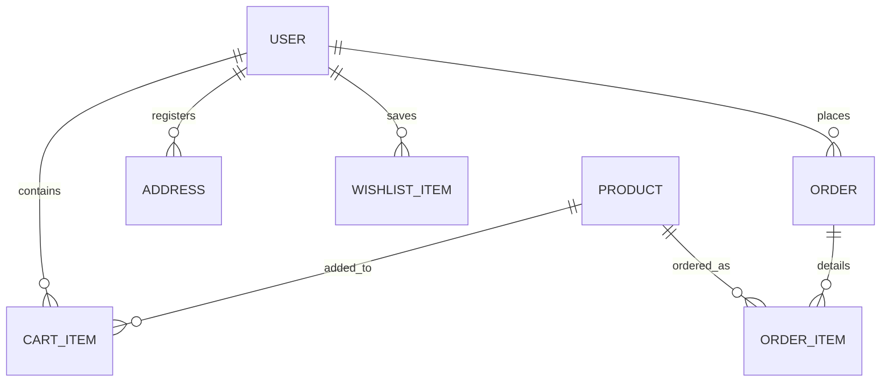

# 🥦 VegeStore - Full Stack Vegetable E-Commerce
*A scalable full-stack e-commerce application utilizing a Python Flask REST API and a React frontend, featuring dynamic recommendations and coupon processing.*

VegeStore is an e-commerce platform built to demonstrate relational database engineering, API design, and search indexing. It includes a smart recommendation engine that analyzes order history, active coupons, and wishlists to provide real-time suggestions.

---

## 🚀 Key Features

*   **Flask Blueprint Architecture:** A highly modular API divided into 12 distinct blueprints, isolating auth, products, payments, coupons, and orders logic.
*   **Smart Suggestions Engine:** A recommendation algorithm that parses the user's past orders and category frequencies to suggest relevant items.
*   **Secure Authentication:** User registration, password encryption (using `Flask-Bcrypt`), and session tokens (`Flask-JWT-Extended`).
*   **Active Cart & Wishlist System:** Relational tables managing shopping sessions and user wishlist records.
*   **Store Finder API:** Relational mapping of 5 imaginary retail locations, complete with contacts, hours, and geo-coordinates.
*   **Coupon Validation Engine:** Applied discounts validation checking date expiries, minimum spends, and coupon limits.
*   **Simulated Payment Processing:** Endpoint processing payments with transaction statuses, generating transactional audit logs.

---

## 📂 System Architecture

```text
vegestore/
├── backend/                  # RESTful API Server (Python Flask)
│   ├── routes/               # Blueprint routing (auth, cart, products, etc.)
│   ├── instance/             # SQLite database file (in development)
│   ├── models.py             # SQLAlchemy Relational Models
│   ├── seed.py               # Database seeding utility
│   ├── app.py                # Flask entry point and settings
│   └── requirements.txt      # Python dependencies manifest
│
└── frontend/                 # Client UI (React 18 + React Router)
    ├── src/
    │   ├── components/       # Cart widgets, layout containers, card items
    │   ├── context/          # Context API state providers
    │   ├── pages/            # Page layouts (Cart, Shop, Auth, Checkout)
    │   └── services/         # API connection layers
```

---

## 📊 Database Relational Schemas (SQLAlchemy)

The application uses SQLAlchemy to model relationships, enforce foreign key constraints, and manage cascade deletions.



### Relational Tables Overview:
1.  **User Model (`users`):** Handles profile fields, encrypted password, and relationships to orders and addresses.
2.  **Product Model (`products`):** Tracks price, stock, category, organic certification, and image assets.
3.  **CartItem Model (`cart_items`):** Relational link mapping `user_id` and `product_id` with checkout quantities.
4.  **WishlistItem Model (`wishlist_items`):** Tracks user interest profiles.
5.  **Order Model (`orders`):** Records completed checkout logs, total amounts, coupon codes, and payment statuses.
6.  **OrderItem Model (`order_items`):** Captures snapshot pricing of products at the time of purchase to ensure historical accuracy.
7.  **Address Model (`addresses`):** Maps shipping coordinates.

---

## 🧠 Smart Suggestions Engine (Algorithm Detail)

A key highlight of VegeStore is the **Smart Suggestions Engine** (`backend/routes/suggestions.py`).

### How the Algorithm Works:
1.  **Extract Order History:** Fetches the logged-in user's past orders:
    ```python
    orders = Order.query.filter_by(user_id=user_id).all()
    ```
2.  **Category Scoring:** Loops through ordered items to build a frequency map of categories (e.g., *Leafy Greens*, *Tubers*, *Fruits*).
3.  **Filter Unpurchased Candidates:** Queries the database for products in the user's favorite categories that they have *not* purchased yet.
4.  **Fallback Logic:** If the user is new (has zero orders), the engine defaults to returning the top 5 trending products by overall sales volume.

---

## 🛠️ Local Setup Guide

### 1. Backend Setup
1. Navigate to the backend directory:
   ```bash
   cd backend
   ```
2. Create and activate a Python virtual environment:
   ```bash
   python -m venv venv
   source venv/bin/activate  # On Windows: venv\Scripts\activate
   ```
3. Install dependencies:
   ```bash
   pip install -r requirements.txt
   ```
4. Run the seed script to initialize database records:
   ```bash
   python seed.py
   ```
5. Boot the development API server:
   ```bash
   python app.py
   ```
   *The API will start at `http://localhost:5000`.*

### 2. Frontend Setup
1. Navigate to the frontend directory:
   ```bash
   cd ../frontend
   ```
2. Install npm dependencies:
   ```bash
   npm install
   ```
3. Run the development server:
   ```bash
   npm start
   ```
   *The client will start at `http://localhost:3000`.*

---

## 💬 Interview Discussion Notes (For Recruiters)

*   **Question: "Why did you use SQLite for development and PostgreSQL for production?"**
    *   *Answer:* "SQLite is a lightweight, serverless database that stores records in a local file, making it ideal for fast development and testing. However, it lacks support for concurrent writes and row-level locking. For production, I configured PostgreSQL to support concurrent connections and data scaling."
*   **Question: "How does your coupon validation engine prevent duplicate claims?"**
    *   *Answer:* "The coupon check runs validation logic against the database: first, it checks if the coupon's expiration date is in the future. Second, it verifies if the cart total exceeds the minimum spend. Third, it checks the `orders` table to ensure the user has not exceeded the maximum claims limit allowed for that coupon code, preventing duplicate applications."